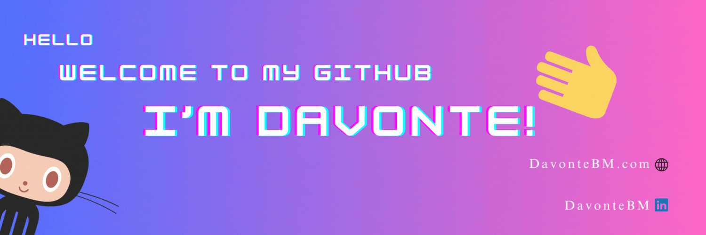

***
# Hello, I'm Davonte! 👋

Welcome To My Github Page ...

_My name is **Davonte Bertrand-Murrell**, a **software developer** who is passionate about building secure & scalable software._

***

### 🚀 About Me
- 📍 I'm based in Toronto, Canada.
- 👩‍💻 I work in web development (I mainly enjoy being on the backend but I'm also capable of working in the frontend).
- 🧠 I'm intrested in learning Typescript, Nextjs Rust, Kubernetes, Redis and Go. 
- 🤝 I'm always looking forward to contributing and working with others so please feel free to contact me.
- ⚡ Fun facts about me: I love working out, reading philosophy, training martial arts and going on walks with my dog Zeus.

***

### 🔗 Connect With Me

***

